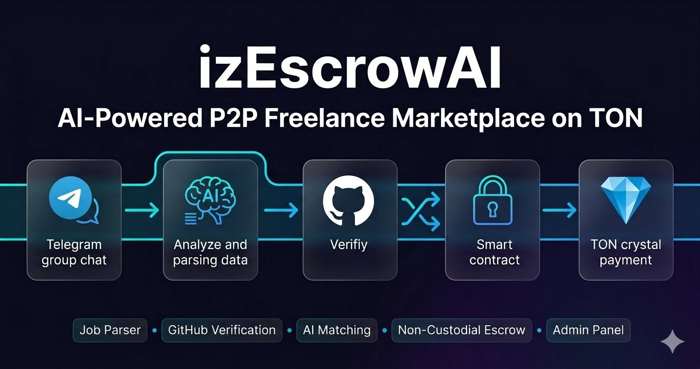
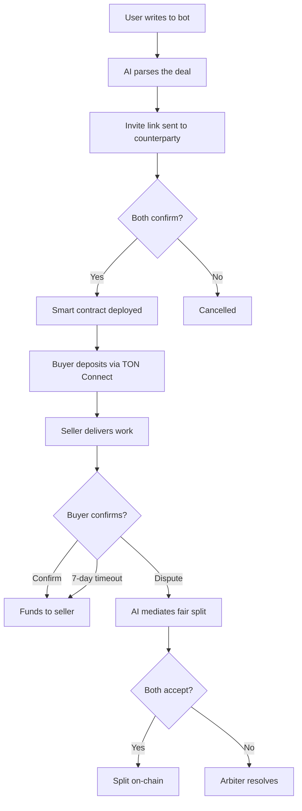
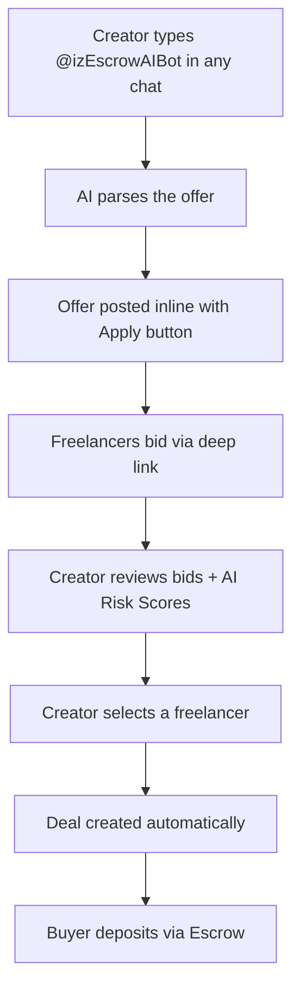
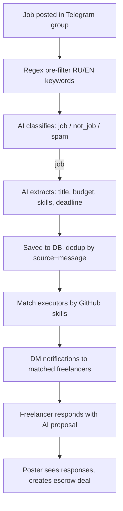
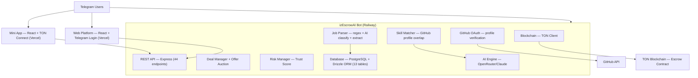
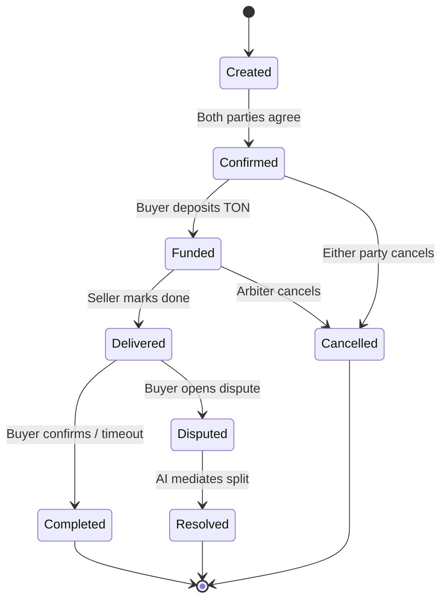

# izEscrowAI

**AI-powered P2P freelance marketplace on TON blockchain — non-custodial escrow, job parser from Telegram groups, GitHub verification, admin panel, and AI at every stage.**



## What is it

izEscrowAI is a decentralized P2P freelance exchange built as a Telegram bot + Mini App + Web platform. Create deals in chat, post offers via inline mode, auto-parse job postings from Telegram groups, verify skills through GitHub OAuth, and lock funds in a smart contract on TON. AI handles deal parsing, job classification, skill matching, proposal generation, risk scoring, and dispute mediation. Funds are held by the contract, not the bot — fully non-custodial.

## How it works

### Direct Deal (1-on-1)



### Marketplace (Inline Offers + Auction)



### Job Parser (Auto-detect from Groups)



## Key Features

### Core
- **Non-custodial escrow** — funds held by smart contract, not the bot
- **Natural language parsing** — create deals by chatting, not filling forms
- **AI dispute mediation** — disputes analyzed with fair split proposals
- **Multi-currency deals** — specify amounts in $, €, ₽ with auto-conversion to TON
- **1% on-chain platform fee** — transparent fee deducted by the smart contract
- **TON Connect integration** — pay directly from your wallet in Telegram

### Marketplace
- **Public offers** — post via inline mode in any Telegram chat or group
- **Auction / Bidding** — freelancers compete with price bids, creator picks the best
- **Full-text search** — PostgreSQL tsvector search across offers

### Job Parser & Matching
- **Auto-detect jobs from groups** — regex + AI pipeline parses job postings from monitored Telegram groups
- **Skill-based matching** — match parsed jobs to freelancers by GitHub language overlap
- **AI proposal generation** — generate personalized proposals based on GitHub profile + job requirements
- **Poster identification** — link parsed jobs to their posters, notify when freelancers respond
- **Response flow** — freelancers respond to jobs, posters review and create escrow deals directly

### GitHub Verification
- **GitHub OAuth** — verify developer identity through GitHub account linking
- **GitHub Score** — automated scoring based on repos, stars, commits, languages, organizations
- **Trust Score boost** — GitHub-verified users get higher trust, with green/red flag analysis
- **Skill extraction** — auto-detect developer skills from GitHub language stats

### Admin Panel
- **Dashboard** — real-time metrics: users, deals, volume, disputes, sources
- **Source management** — add/pause/disable monitored Telegram groups
- **Job moderation** — verify/spam/expire parsed jobs
- **User management** — search users, view profiles, ban/unban
- **Dispute resolution** — review disputes, refund buyer or pay seller with resolution notes
- **Platform settings** — runtime configuration (fees, limits, features) via key-value store

### Trust & Risk
- **Trust Score** — deterministic 0-100 score: rating (30%), deals (25%), dispute-free (20%), speed (15%), repeats (10%)
- **AI Risk Assessment** — analyzes user metrics and deal parameters, returns risk level + recommendations
- **Ban enforcement** — banned users blocked at bot and API level

### Web Platform
- **Landing page** — public marketplace with live stats, talent grid, activity feed
- **Web auth** — Telegram Login Widget for browser access
- **Responsive design** — works in Telegram Mini App and standalone browser

## Business Model

A transparent 1% fee is deducted on-chain by the smart contract when a deal completes (confirm, resolve, or timeout). The fee goes directly to the platform wallet — no off-chain billing, no hidden charges. On cancel, the buyer gets a full refund with zero fees.

## Architecture



## Tech Stack

| Component | Technology |
|-----------|------------|
| Bot framework | TypeScript, [grammY](https://grammy.dev/) |
| AI engine | [OpenRouter](https://openrouter.ai/) (Claude) with function calling |
| Database | PostgreSQL + [Drizzle ORM](https://orm.drizzle.team/) + tsvector full-text search |
| Smart contract | [Tolk](https://docs.ton.org/v3/documentation/smart-contracts/tolk/overview) (TON) |
| Mini App | React, [Vite](https://vite.dev/), [@tonconnect/ui-react](https://github.com/nickelc/tonconnect-ui-react) |
| Web platform | React, React Router, Telegram Login Widget |
| Blockchain | [@ton/core](https://github.com/ton-org/ton), TON Connect v2 |
| Price feeds | [tonapi.io](https://tonapi.io/) — live TON/USD/EUR/RUB rates |
| Hosting | [Railway](https://railway.app/) (bot + API), [Vercel](https://vercel.com/) (mini-app) |

## AI Capabilities

| Capability | Description |
|------------|-------------|
| **Deal Parsing** | Natural language → structured deal (seller, buyer, amount, currency, description) |
| **Offer Parsing** | Inline text → public offer with role detection and price extraction |
| **Bid Parsing** | Free-text bid → price + optional message |
| **Job Classification** | Group message → job / not_job / spam with confidence score |
| **Job Extraction** | Job post → title, description, budget, skills, deadline, contacts |
| **Skill Matching** | GitHub languages vs. job requirements → match percentage |
| **Proposal Generation** | Job description + GitHub profile → personalized 2-3 paragraph proposal |
| **Dispute Mediation** | Analyzes evidence from both parties, proposes fair % split |
| **Trust Score** | Deterministic 0-100 score: rating (30%), deals (25%), dispute-free (20%), speed (15%), repeats (10%) |
| **Risk Assessment** | AI analyzes user metrics and deal parameters, returns risk level + recommendations |
| **GitHub Scoring** | Repo count, stars, commits, languages, orgs → GitHub Score + green/red flags |
| **Skill Extraction** | Job description text → required skills array |

## Built with

- [izTolkMcp](https://github.com/izzzzzi/izTolkMcp) — open-source MCP server for compiling Tolk smart contracts
- [TON Documentation](https://docs.ton.org/) — blockchain reference
- [grammY](https://grammy.dev/) — Telegram bot framework
- [OpenRouter](https://openrouter.ai/) — unified API for LLMs
- [tonapi.io](https://tonapi.io/) — TON price feeds for multi-currency conversion

## Try it

- **Bot**: [@izEscrowAIBot](https://t.me/izEscrowAIBot)
- **Mini App**: [iz-escrow-ai.vercel.app](https://iz-escrow-ai.vercel.app)

## Project Structure

```text
izEscrowAI/
├── bot/                          # Telegram Bot + API server
│   └── src/
│       ├── index.ts              # Entry point, periodic jobs, graceful shutdown
│       ├── bot/index.ts          # grammY bot, commands, inline mode, auction callbacks
│       ├── ai/
│       │   ├── index.ts          # AI classification, parsing, mediation, risk scoring, proposals
│       │   ├── prompts.ts        # System prompts, tool definitions
│       │   └── provider.ts       # AI provider abstraction (OpenRouter)
│       ├── parser/
│       │   ├── index.ts          # Job parsing pipeline: regex → classify → extract → save → match
│       │   ├── regex.ts          # Regex pre-filter (RU/EN keywords)
│       │   └── matching.ts       # Skill-based executor matching
│       ├── github/
│       │   ├── index.ts          # GitHub OAuth flow, profile fetching
│       │   └── score.ts          # GitHub Score calculation, flag detection
│       ├── deals/index.ts        # Deal state machine, offer→deal, metrics collection
│       ├── rates.ts              # TON price fetching, fiat→TON conversion
│       ├── blockchain/           # TON client, contract deployment
│       ├── db/
│       │   ├── schema.ts         # Drizzle ORM schema (13 tables)
│       │   ├── index.ts          # PostgreSQL connection, all CRUD functions
│       │   └── setup-search.sql  # tsvector + GIN index setup
│       └── api/
│           ├── index.ts          # Express REST API (44 endpoints)
│           └── auth.ts           # Telegram Login Widget verification
├── mini-app/                     # Telegram Mini App + Web Platform
│   └── src/
│       ├── App.tsx               # Router: Mini App / Web with admin routes
│       ├── contexts/
│       │   └── AuthContext.tsx    # Dual auth: initData + Telegram Login + admin check
│       ├── pages/
│       │   ├── WalletPage.tsx    # Wallet connection
│       │   ├── PaymentPage.tsx   # Risk assessment + TON Connect payment
│       │   ├── DealsPage.tsx     # Deals + Offers tabs
│       │   ├── ProfilePage.tsx   # Trust Score, GitHub, reputation (mini-app)
│       │   ├── WebProfilePage.tsx# Profile for web platform
│       │   ├── LandingPage.tsx   # Public landing with stats + talent grid
│       │   ├── OffersPage.tsx    # Public offers marketplace
│       │   ├── OfferDetailPage.tsx# Offer detail with bids
│       │   ├── MarketPage.tsx    # Parsed jobs marketplace with filters
│       │   ├── MyJobResponsesPage.tsx # Poster view: responses to their jobs
│       │   ├── LeaderboardPage.tsx    # Group leaderboard
│       │   ├── GroupDashboardPage.tsx # Group analytics dashboard
│       │   └── admin/
│       │       ├── AdminDashboard.tsx  # Metrics overview
│       │       ├── AdminSources.tsx   # Source CRUD
│       │       ├── AdminJobs.tsx      # Job moderation
│       │       ├── AdminUsers.tsx     # User management + bans
│       │       ├── AdminDisputes.tsx  # Dispute resolution
│       │       └── AdminSettings.tsx  # Platform settings
│       ├── components/           # 28 reusable components
│       │   ├── TabNav.tsx        # Bottom navigation (mini-app)
│       │   ├── WebNavbar.tsx     # Top navigation (web)
│       │   ├── AdminLayout.tsx   # Admin sidebar layout
│       │   ├── DataTable.tsx     # Sortable table with pagination
│       │   ├── GitHubCard.tsx    # GitHub profile display
│       │   ├── JobCard.tsx       # Parsed job card
│       │   ├── JobFilters.tsx    # Job search filters
│       │   ├── ProposalModal.tsx # AI proposal generation + respond
│       │   ├── CreateDealModal.tsx# Deal from job response
│       │   └── ...              # DealCard, OfferCard, UserCard, etc.
│       └── lib/api.ts           # Typed API client (50+ functions)
└── contracts/
    ├── escrow.tolk              # Escrow smart contract source
    └── compiled/                # Pre-compiled code cell (hex)
```

## Database Schema (13 tables)

| Table | Description |
|-------|-------------|
| `users` | Telegram users with wallet, notification prefs, ban status |
| `deals` | Escrow deals with status, amounts, dispute resolution fields |
| `reputation` | User reputation metrics (deals, ratings, disputes, speed) |
| `offers` | Inline marketplace offers with auction support |
| `applications` | Bids on offers from freelancers |
| `group_stats` | Telegram group analytics (volume, deals, conversion) |
| `deal_groups` | Many-to-many: deals ↔ groups |
| `github_profiles` | Linked GitHub accounts with scores, languages, flags |
| `sources` | Monitored Telegram groups for job parsing |
| `parsed_jobs` | AI-extracted jobs from group messages |
| `job_responses` | Freelancer responses to parsed jobs |
| `platform_settings` | Runtime key-value configuration |
| `risk_assessments` | Cached AI risk assessment results |

## API Endpoints (44 total)

### Public
| Method | Endpoint | Description |
|--------|----------|-------------|
| GET | `/api/stats` | Platform statistics |
| GET | `/api/offers/public` | Public offers marketplace |
| GET | `/api/offers/public/:id` | Public offer detail |
| GET | `/api/talent` | Top talent grid |
| GET | `/api/activity` | Recent activity feed |
| GET | `/api/jobs` | Parsed jobs with filters (skills, budget, status) |
| GET | `/api/jobs/:id` | Job detail with skill match |

### GitHub
| Method | Endpoint | Description |
|--------|----------|-------------|
| GET | `/api/github/auth` | Start GitHub OAuth flow |
| GET | `/api/github/callback` | OAuth callback, save profile |
| POST | `/api/github/unlink` | Unlink GitHub account |

### Authenticated (initData / Telegram Login)
| Method | Endpoint | Description |
|--------|----------|-------------|
| GET | `/api/deals` | User's deals |
| GET | `/api/deals/:id` | Deal details |
| POST | `/api/wallet` | Set wallet address |
| GET | `/api/offers` | User's offers |
| GET | `/api/offers/:id` | Offer with bids + reputations |
| POST | `/api/offers` | Create offer |
| POST | `/api/offers/:id/apply` | Submit bid |
| POST | `/api/offers/:id/select/:appId` | Select freelancer, create deal |
| GET | `/api/profile` | Own profile + Trust Score |
| GET | `/api/profile/:userId` | Public profile |
| GET | `/api/risk/deal/:dealId` | Deal risk assessment |
| GET | `/api/groups` | Group leaderboard |
| GET | `/api/groups/:id` | Group analytics |
| POST | `/api/jobs/:id/proposal` | AI-generated proposal |
| POST | `/api/jobs/:id/respond` | Respond to parsed job |
| GET | `/api/jobs/:id/has-responded` | Check if already responded |
| GET | `/api/my-jobs` | Poster's jobs from groups |
| GET | `/api/my-jobs/:id/responses` | Responses to poster's job |
| POST | `/api/my-jobs/:id/create-deal` | Create deal from response |

### Admin (admin-only)
| Method | Endpoint | Description |
|--------|----------|-------------|
| GET | `/api/admin/me` | Check admin status |
| GET | `/api/admin/dashboard` | Dashboard metrics |
| GET | `/api/admin/sources` | List sources |
| POST | `/api/admin/sources` | Create source |
| PUT | `/api/admin/sources/:id` | Update source |
| DELETE | `/api/admin/sources/:id` | Disable source |
| GET | `/api/admin/jobs` | List parsed jobs |
| PUT | `/api/admin/jobs/:id/status` | Change job status |
| GET | `/api/admin/users` | Search users |
| GET | `/api/admin/users/:id` | User detail |
| PUT | `/api/admin/users/:id/ban` | Toggle ban |
| GET | `/api/admin/disputes` | Active disputes |
| POST | `/api/admin/disputes/:dealId/resolve` | Resolve dispute |
| GET | `/api/admin/settings` | All settings |
| PUT | `/api/admin/settings` | Update settings |

## Contract Functions

| Function | Description |
|----------|-------------|
| `deposit()` | Buyer deposits funds (via TON Connect) |
| `confirm()` | Arbiter confirms delivery → 1% fee to platform, rest to seller |
| `cancel()` | Arbiter cancels → full refund to buyer (no fee) |
| `resolve(split%)` | Arbiter resolves dispute → 1% fee, then split remainder |
| `timeout()` | Permissionless auto-release → 1% fee to platform, rest to seller |
| `getDealState()` | Getter for off-chain monitoring |

## Deal States



- **Deposit**: Buyer signs via TON Connect (their wallet, their signature)
- **Confirm/Cancel/Resolve**: Arbiter (bot) sends on-chain from its wallet
- **Timeout**: Permissionless — anyone can trigger after deadline

## Local Development

### Prerequisites

- Node.js 18+
- PostgreSQL 14+
- Telegram bot token ([BotFather](https://t.me/BotFather))
- OpenRouter API key ([openrouter.ai](https://openrouter.ai/))
- TON wallet mnemonic (for arbiter)
- GitHub OAuth App (for developer verification)

### Bot

```bash
cd bot
cp .env.example .env  # Fill in your keys
npm install
npx drizzle-kit push  # Create tables
psql -d izescrow -f src/db/setup-search.sql  # Full-text search
npm run dev
```

### Mini App

```bash
cd mini-app
npm install
npm run dev
```

### Smart Contract

Compile `contracts/escrow.tolk` using [izTolkMcp](https://github.com/izzzzzi/izTolkMcp) or the Tolk compiler:

```bash
npx @ton/tolk-js --output-json contracts/compiled/escrow.json contracts/escrow.tolk
node -e "const j=require('./contracts/compiled/escrow.json');require('fs').writeFileSync('./contracts/compiled/escrow.hex',Buffer.from(j.codeBoc64,'base64').toString('hex'))"
```

### Environment Variables

| Variable | Description |
|----------|-------------|
| `BOT_TOKEN` | Telegram bot token from BotFather |
| `OPENROUTER_API_KEY` | AI model API key |
| `DATABASE_URL` | PostgreSQL connection string |
| `TON_MNEMONIC` | Arbiter wallet mnemonic (24 words) |
| `MINI_APP_URL` | Mini App URL for CORS |
| `GITHUB_CLIENT_ID` | GitHub OAuth App client ID |
| `GITHUB_CLIENT_SECRET` | GitHub OAuth App client secret |
| `ADMIN_TELEGRAM_IDS` | Comma-separated admin Telegram IDs |

## Roadmap

- [x] Core escrow with AI deal parsing
- [x] Inline offers marketplace with auction bidding
- [x] Trust Score + AI Risk Assessment
- [x] Group analytics and leaderboard
- [x] Web platform with Telegram Login
- [x] GitHub OAuth verification + GitHub Score
- [x] Job parser from Telegram groups (regex + AI pipeline)
- [x] Skill matching + notification system
- [x] AI proposal generation
- [x] Job poster matching + response flow
- [x] Admin panel (dashboard, sources, jobs, users, disputes, settings)
- [x] Platform settings runtime configuration
- [x] Ban enforcement (bot + API)
- [x] AGPL-3.0 licensing
- [ ] Payment webhooks for deal status sync
- [ ] Multi-language support (i18n)
- [ ] Advanced analytics dashboard
- [ ] Mobile-optimized Web App

## What Makes This Unique

1. **Full P2P Marketplace** — not just escrow, but inline offers + auto-parsed jobs from Telegram groups
2. **Non-Custodial** — bot never holds funds; everything in smart contracts
3. **AI at Every Stage** — parsing, job classification, skill matching, proposal generation, risk scoring, dispute mediation
4. **GitHub Verification** — link GitHub to prove skills, auto-match to relevant jobs
5. **Poster → Deal Pipeline** — job posted in group → AI parses → matched freelancers respond → poster creates escrow deal
6. **Trust Score** — deterministic reputation scoring with AI-powered risk analysis
7. **Admin Panel** — full platform management: sources, jobs, users, disputes, settings
8. **Viral Growth** — every inline offer and parsed job invites new users into the ecosystem

## Forking Guide

izEscrowAI uses a two-tier config pattern to separate public defaults from private customizations:

- `prompts.default.ts` — committed, contains public default AI prompts and tool definitions
- `prompts.ts` — gitignored, your private overrides (create by copying the default)
- `weights.default.ts` — committed, contains public Trust Score formula weights
- `weights.ts` — gitignored, your private weights

To customize: copy `*.default.ts` to `*.ts` in the same directory and edit. The loader picks up private files automatically.

## License

[AGPL-3.0](./LICENSE) — If you run a modified version of this software as a service, you must release your source code under the same license. This protects the platform's AI prompts and scoring algorithms while keeping the code open source.
